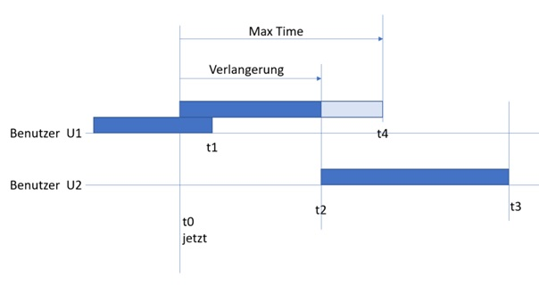

# library
Library

## Integration test for method  delete book

1. Checking, which books have reservation:
GET http://localhost:8080/reservations
The books id=1, 2, and 5 have reservations

2. Deleting book with reservation ( book id =1 )
DELETE http://localhost:8080/books/1

3. Checking the list of books
GET http://localhost:8080/books
the book id=1  and book id=3 exists

4. deleting the book id=3
DELETE http://localhost:8080/books/3

5. cheking the list of books
GET http://localhost:8080/books
the book id=3 does not exists

# Meine Gedanke über Geschäftslogik

1.	Die Zeit  der Reservation schuld sein begrenzt z.B. bis 30 Tage. Das sollte konfiguriert sein, aber Ich habe das hart kodiert.
2.	Die Zahl des Buchers solle auch begrenzt sein und das auch soll konfiguriert sein.
3.	Die Zahl des Verlängerungen auch soll begrenzt sein.
4.	 Die Verlängerung sollte auch folgende Regeln beachten:

Verlängerung beginnt in Moment wenn der Benutzer machte die Interaktion. Das ist eine Vereinfachung, aber das machte leichte Berechnung der Zeit.  

 
Benutzer U1 hat laufender Reservierung bis Zeitpunkt t1.

Benutzer U2 hat Reservierung, die beginnt in Zeitpunkt t2.

Jetzt in Zeitpunkt t0 Benutzer U1 machte Verlängerung in maximalen Zeit.

Die mögliche Verlängerung endet in Zeitpunkt t2;

